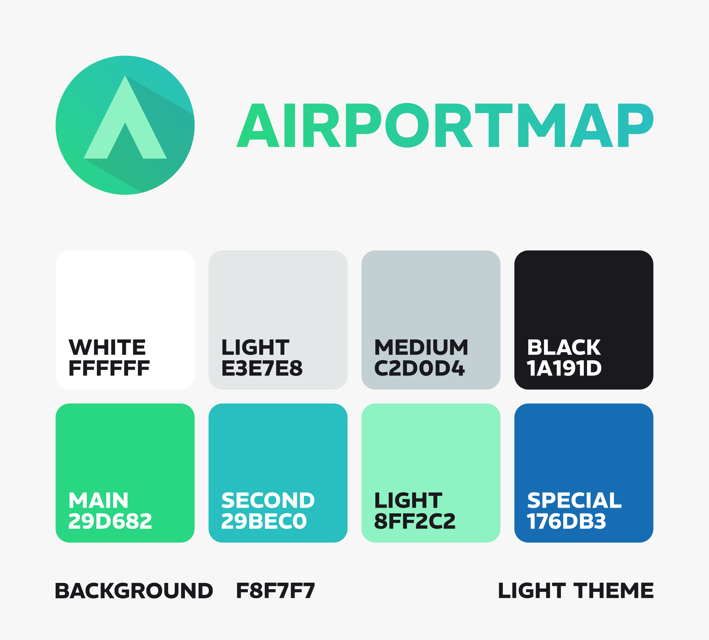
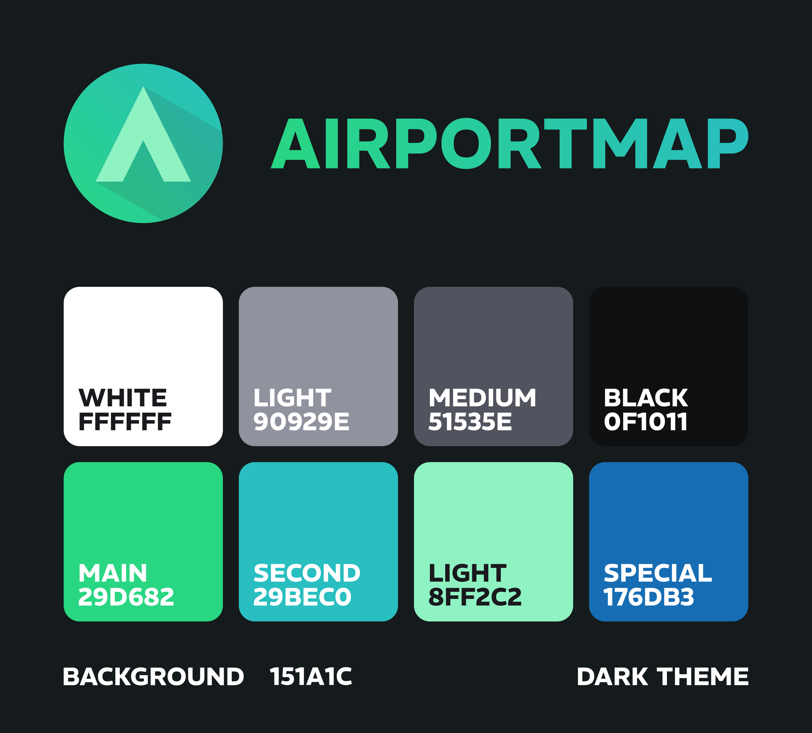

# Airportmap Style Guide

This repository provides the official style guide for the Airportmap project. It contains the original logo, wordmark, and color specifications used across the Airportmap website and associated services or applications.

These assets may be used freely for referencing or describing Airportmap, provided the usage is clearly associated with the project and the developer [@komed3](https://github.com/komed3). Any use must remain contextually relevant to Airportmap and its ecosystem.

## Logo

The Airportmap logo is based on a minimal and geometric design language, reflecting the project’s focus on aviation, cartography, and digital infrastructure.

Its core element is a stylized “A”, framed by a circular gradient spanning from teal to turquoise. This symbol subtly references both the first letter of the project name and the silhouette of an aircraft or navigation arrow.

The logo is available in multiple formats (PNG, SVG), including a reduced monochrome variant for small-scale use or integration as an icon or favicon.

## Wordmark

The wordmark complements the logo both in shape and color, using the same gradient from green to cyan.

Set in the REM typeface—also used throughout the Airportmap website—it consists of the project name in uppercase letters. Variants are available in scalable formats (PNG and SVG) for use in headers, footers, or printed documentation.

## Color Scheme

Two main color schemes are provided for light and dark themes, derived directly from the logo’s base colors. These include primary accent tones as well as grayscale levels for background surfaces, UI elements, and typography.

---

**© MIT License – 2025 Paul Köhler ([@komed3](https://github.com/komed3))**